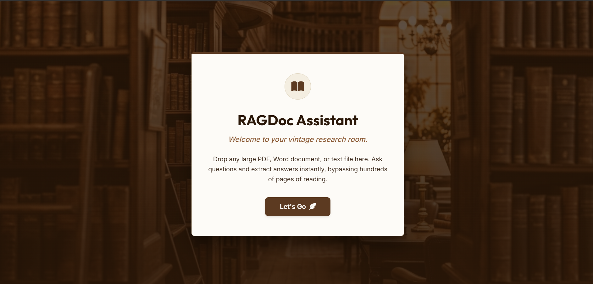
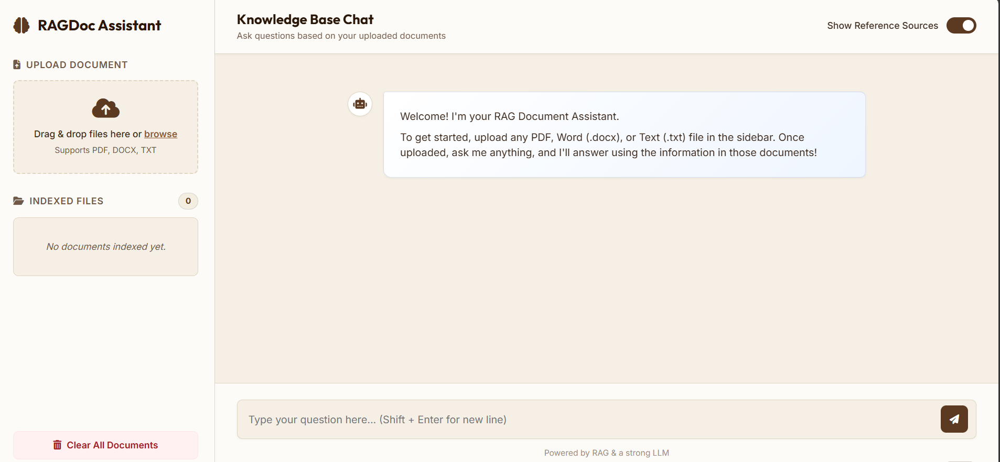

# 🤖 RAGDoc Assistant     
 
An AI-powered **Retrieval-Augmented Generation (RAG)** Document Assistant that allows users to upload PDF, DOCX, and TXT files and ask questions in natural language. The application retrieves relevant document content using semantic search and generates accurate answers with **Google Gemini AI** while displaying reference sources.

---

# 🌐 Live Application:  https://ragdoc-assistent.onrender.com/

---

## 📸 Screenshots

### 🏠 Landing Page



---

### 💬 Main Chat Interface



---                  
                                                                     
## ✨ Features

- 📄 Upload PDF, DOCX and TXT documents
- 🤖 AI-powered question answering using Google Gemini
- 🔍 Semantic search with vector embeddings
- 🧠 Retrieval-Augmented Generation (RAG)
- ☁️ Supabase Vector Database integration
- 📚 Automatic document chunking
- 📌 Source references with page numbers
- 🗑️ Clear indexed documents
- 🎨 Modern and responsive user interface

---

## 🛠️ Tech Stack

### Frontend
- HTML5
- CSS3
- JavaScript

### Backend
- Python
- Flask

### AI & Machine Learning
- Google Gemini 2.5 Flash
- Gemini Embedding Model
- LangChain

### Database
- Supabase
- pgvector

### Document Processing
- PyPDF
- python-docx

---

## 📂 Project Structure

```text
RAGDoc_Assistant/
│
├── app.py
├── requirements.txt
├── README.md
├── .gitignore
│
├── data/
├── static/
├── templates/
│
├── landing-page.png
├── main-ui.png
│
└── .env 
```

---

## ⚙️ Installation

### Clone Repository

```bash
git clone https://github.com/yourusername/RAGDoc-Assistant.git

cd RAGDoc-Assistant
```

### Create Virtual Environment

```bash
python -m venv .venv
```

Activate

**Windows**

```bash
.venv\Scripts\activate
```

### Install Dependencies

```bash
pip install -r requirements.txt
```

---

## 🔑 Environment Variables

Create a `.env` file in the project root.

```env
GEMINI_API_KEY=YOUR_GEMINI_API_KEY

SUPABASE_URL=YOUR_SUPABASE_URL

SUPABASE_KEY=YOUR_SUPABASE_KEY

LLM_PROVIDER=gemini

GEMINI_QA_MODEL=models/gemini-2.5-flash

GEMINI_EMBEDDING_MODEL=models/gemini-embedding-2

FLASK_SECRET_KEY=your_secret_key
```

---

## ▶️ Run the Project

```bash
python app.py
```

Open your browser and visit:

```
http://127.0.0.1:5000
```

---

## 🔄 RAG Workflow

```text
Upload Document
        │
        ▼
Extract Text
        │
        ▼
Text Chunking
        │
        ▼
Gemini Embeddings
        │
        ▼
Supabase Vector Database
        │
        ▼
User Question
        │
        ▼
Similarity Search
        │
        ▼
Relevant Context
        │
        ▼
Gemini LLM
        │
        ▼
Final Answer with Source References
```

---

## 📦 Dependencies

- Flask
- LangChain
- Google Generative AI
- Supabase
- PyPDF
- python-docx

---

## 🔒 Security

- Environment variables are stored in a `.env` file.
- API keys are never committed to GitHub.
- `.env` is ignored using `.gitignore`.

---

## 🚀 Future Enhancements

- Multiple document collections
- OCR support for scanned PDFs
- User authentication
- Chat history
- Dark mode
- Cloud deployment improvements
- Mobile responsive enhancements

---

## 👨‍💻 Author : Yatendra Kumar Gupta

---

## ⭐ Support

If you found this project helpful, please consider giving it a **⭐ Star** on GitHub!# RAGDoc_Assistant
